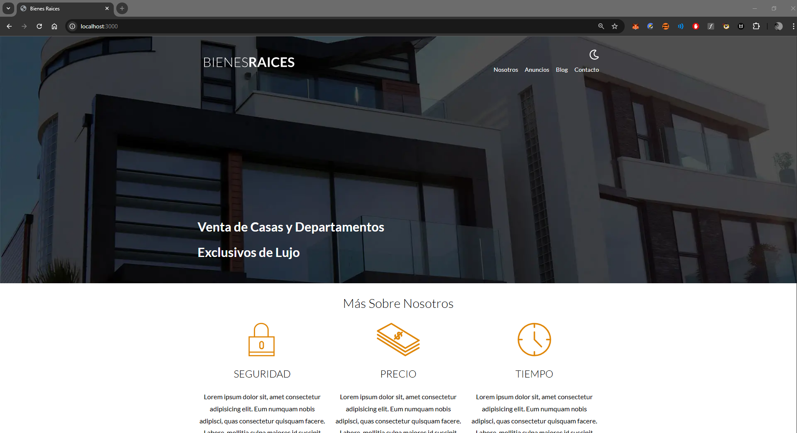
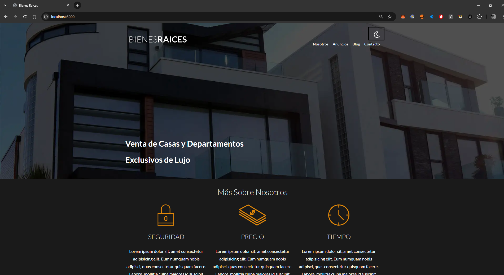
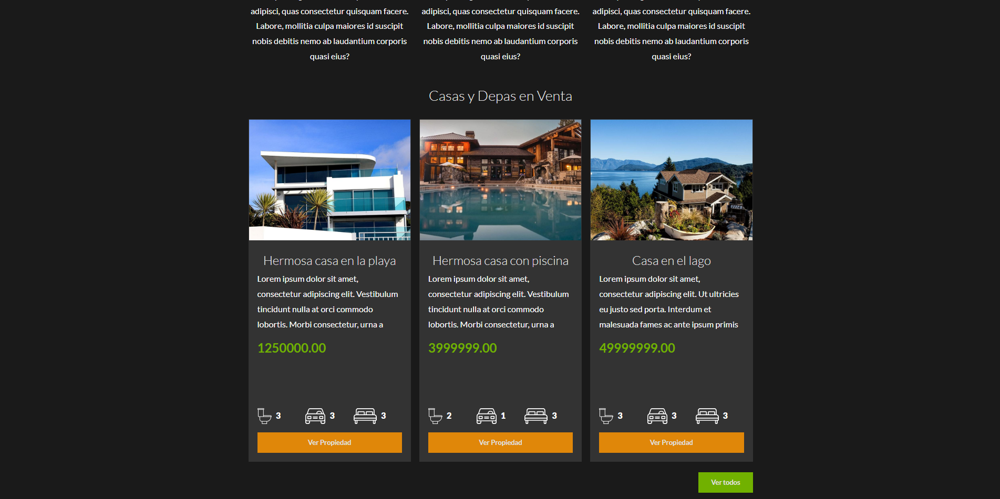
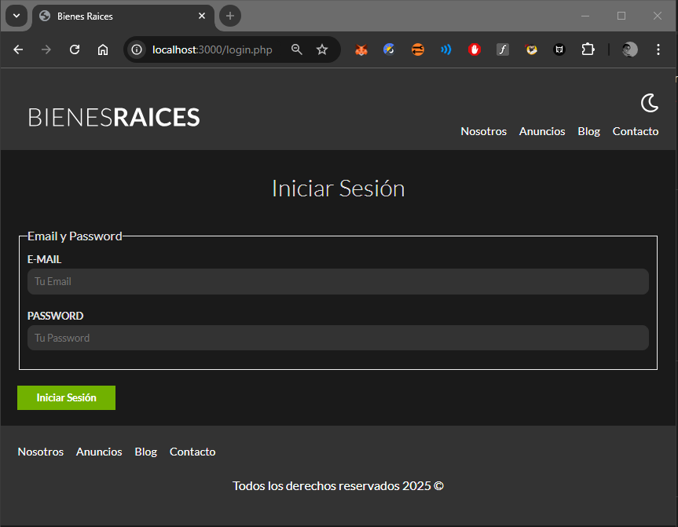
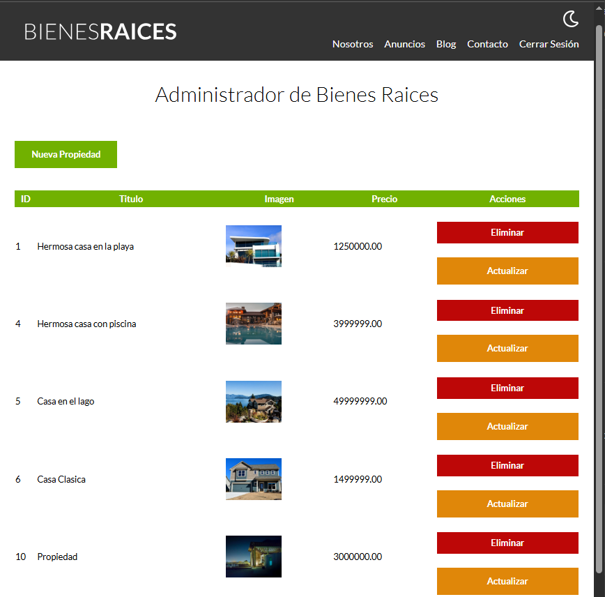
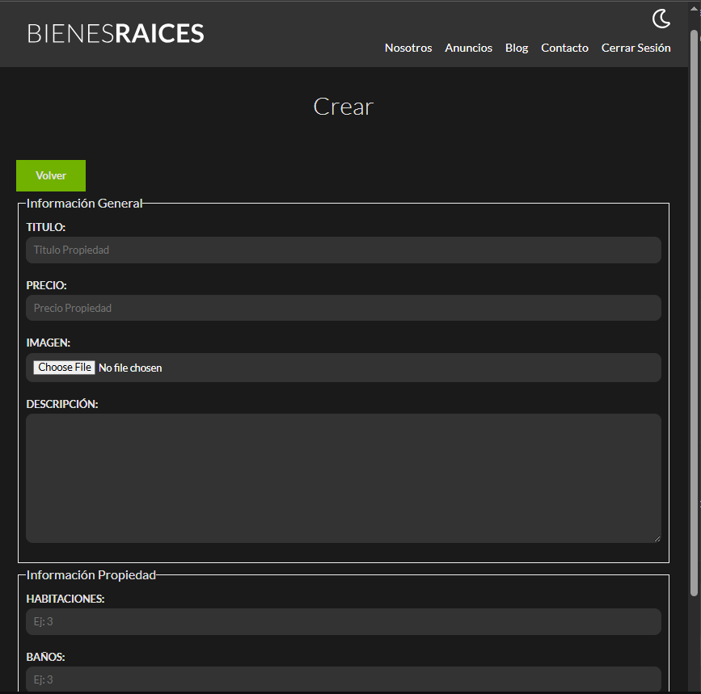

# 🏡 Bienes Raíces

Proyecto web completo desarrollado como práctica de un sistema inmobiliario.  
Permite gestionar propiedades, vendedores y usuarios(a travez de la base de datos), conectándose a una base de datos **MySQL** y utilizando herramientas como **PHP**, **SASS**, **Gulp**, y **npm** para automatizar el flujo de desarrollo.  

## 🏠 Vista principal


## 🏠 Vista principal oscura


### 🏡 **Anuncios**


### 🔐 **Login**


### 🧭 **Panel Administrador**





---

## 🚀 Tecnologías utilizadas

- **PHP** — Lógica del servidor y conexión a base de datos.  
- **MySQL** — Base de datos relacional para almacenar propiedades, usuarios y vendedores.  
- **HTML5 / CSS3 / SASS** — Estructura y estilos del sitio.  
- **JavaScript ** — Interactividad en el lado del cliente.  
- **Gulp** — Automatización de tareas (compilar SASS, minificar JS, optimizar imágenes, etc.).  
- **npm** — Gestión de dependencias del entorno de desarrollo.  
- **dotenv** — Manejo seguro de credenciales mediante variables de entorno.  

---

## 🧩 Características principales

- Panel de administración para crear, editar y eliminar propiedades.  
- Sistema básico de autenticación.   
- Compilación automática de SASS → CSS y JS → bundle minificado.  
- Arquitectura modular con `includes` y `templates`.  
- Conexión a base de datos segura mediante `.env`.  

---

## ⚙️ Instalación y configuración del entorno

Seguir estos pasos en orden para ejecutar correctamente el proyecto de manera local:

---

### 1️⃣ Clonar el repositorio

Abre tu terminal y ejecuta:
```bash

git clone https://github.com/Jesus-Pareja/Bienes_Raices.git
cd bienesraices_inicio

```
⚙️ Instalación y configuración del entorno

Sigue estos pasos en orden para ejecutar correctamente el proyecto de manera local.

1️⃣ Clonar el repositorio

Abre tu terminal y ejecuta:

```
git clone https://github.com/Jesus-Pareja/Bienes_Raices.git

cd bienesraices_inicio

```
Esto descargará el proyecto y te ubicará en la carpeta principal.

2️⃣ Instalar dependencias

Este proyecto usa npm para las tareas de desarrollo (Gulp)
y Composer para manejar librerías PHP (como vlucas/phpdotenv).

Instala ambas dependencias con:
```
npm install
composer install
```

3️⃣ Configurar variables de entorno

Para mantener seguras tus credenciales, este proyecto usa un archivo .env.

Primero crea un archivo de ejemplo llamado .env.example con este contenido:
```
DB_HOST=localhost
DB_USER=root
DB_PASS=root
DB_NAME=bienesraices_crud

```
Luego, crea una copia llamada .env y edítala con tus credenciales locales:
```
cp .env.example .env

```
Asegúrate de modificar el usuario y contraseña si tu entorno lo requiere.

4️⃣ Configurar la base de datos

El proyecto usa una base de datos llamada bienesraices_crud.

Abre tu gestor MySQL (phpMyAdmin, TablePlus, DBeaver, etc.).

Crea una nueva base de datos con ese nombre:
```
bienesraices_crud

```
Dentro del proyecto, encontrarás el archivo SQL que contiene las tablas necesarias:
```
/database/bienesraices_crud.sql

```

Importa el archivo ejecutando este comando en la terminal:

mysql -u root -p bienesraices_crud < database/bienesraices_crud.sql

⚠️ Si usas TablePlus o phpMyAdmin, también puedes hacerlo manualmente:
abrir la base → click derecho → Import → seleccionar el archivo SQL.

5️⃣ Ejecutar el entorno de desarrollo

🧠 Compilar estilos y scripts con Gulp

El proyecto incluye un flujo de trabajo automatizado con Gulp que:

Compila los archivos .scss en CSS.

Minifica JavaScript.

Optimiza imágenes.

Genera versiones .webp.

Mantiene un watcher que detecta cambios en tiempo real.

Para ejecutarlo:
```
npx gulp

```

Esto dejará corriendo el proceso de compilación.

💻 Iniciar el servidor PHP

Abre otra terminal (o una pestaña nueva) y ejecuta:
```

php -S localhost:3000

```

Ahora abre tu navegador y entra a:
```
http://localhost:3000

```

Si todo está bien, verás el sitio funcionando con estilos y conexión a base de datos.

📁 Estructura del proyecto

bienesraices_inicio/
│
├── admin/ → Panel administrativo
├── build/ → Archivos compilados (CSS, JS minificados)
├── database/ → Archivo SQL con estructura y datos de ejemplo
│ └── bienesraices_crud.sql
├── includes/
│ ├── config/ → Configuración y conexión a la base de datos
│ ├── templates/ → Fragmentos HTML reutilizables
│ └── funciones.php
├── node_modules/ → Dependencias npm
├── src/
│ ├── scss/ → Archivos fuente SASS
│ ├── js/ → Archivos fuente JS
│ └── img/ → Imágenes del sitio
├── .env.example → Variables de entorno de ejemplo
├── .gitignore → Archivos ignorados por Git
├── gulpfile.js → Configuración de tareas Gulp
├── package.json → Dependencias npm
├── composer.json → Dependencias PHP
├── index.php → Página principal
└── README.md → Documentación del proyecto

🧠 Explicación técnica del flujo con Gulp

El archivo gulpfile.js gestiona las siguientes tareas:

css() → Compila SASS a CSS con autoprefixer y cssnano.

javascript() → Minifica y concatena JS con terser.

imagenes() → Optimiza imágenes.

versionWebp() → Crea versiones en formato .webp.

watchArchivos() → Escucha cambios en tiempo real.

exports.default → Ejecuta todas las tareas en paralelo.

Para iniciar todas las tareas juntas:
```

npx gulp

```

🧠 Buenas prácticas aplicadas

Uso de Gulp para automatizar procesos de compilación.

Separación lógica y modular del código PHP.

Manejo de credenciales con dotenv para mayor seguridad.

Control de versiones con Git y estructura profesional del repositorio.

Documentación completa para clonar y ejecutar el proyecto.

Organización visual y de carpetas limpia y escalable.

Exportación de base de datos lista para pruebas o demos.

👨‍💻 Autor

Jesús Pareja Hurtado
Analista Programador
📍 Chile, Antofagasta
GitHub: https://github.com/Jesus-Pareja

📝 Licencia

Este proyecto fue desarrollado con fines educativos y de práctica profesional.
Libre para su uso y referencia en proyectos personales o académicos.
